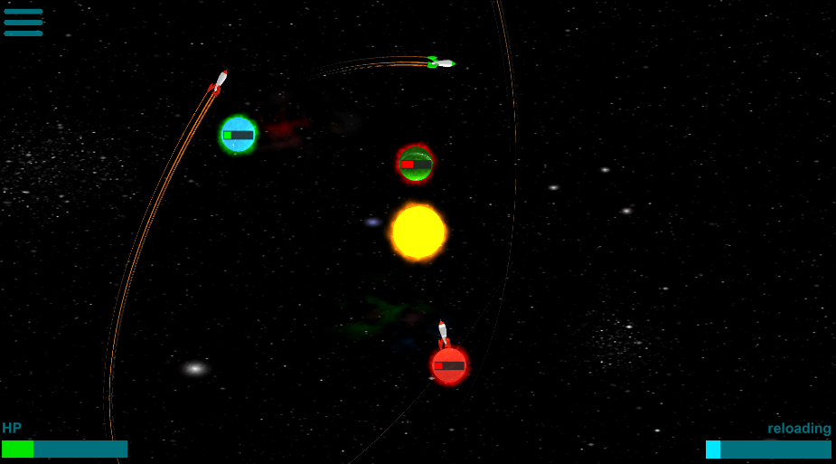
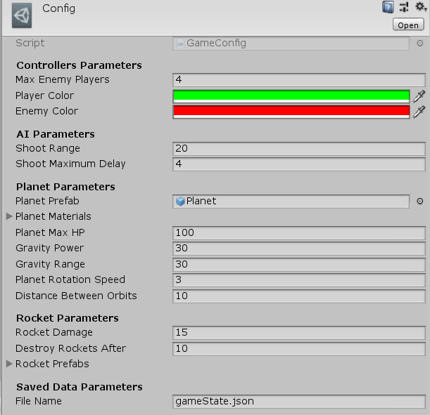

# Orbitality (Game) - Unity Project 

## General notes
The project has been given during the interview process of Ubisoft Kiev

Project completed in Unity (2019.2.13f1)

## Game Description
You are in control of the planet in the Planetary System, where other planets are your enemies, which are controlled by AI logic. Each planet has it's own rockets and can shoot them to any direction, where Planets gravity has its own effect on them. Collision Rocket and planet or other Rocket cause explosion. In case of the planet, it damages the planet. Your goal is to destroy enemy planets before they destroy you. One way to achieve a win, is to defend the planet with your rocket or destroy other planets using them.

## Game Configuration 
 The project contains a scriptable object Config.asset, where all of the important variables are declared. Changing these variables causes a change of Game Play visual and Physics
 

## Game AI logic
There are 3 different **strategy** for **AI logic**:

**random** - Rocket Direction is random and shoots instantly 

**shootClosest** - Rocket is always towards the closest planet and will shoot whenever it is in Range

**shootPlayer** - Shoots Rocket in direction of player instantly 

## Used References
[Smoke Texture](https://www.google.com/search?q=smoke%20texture&tbm=isch&tbs=ic%3Atrans&rlz=1C1CHBF_enGE813GE813&hl=ka&ved=0CAIQpwVqFwoTCIjI6faZkOYCFQAAAAAdAAAAABAC&biw=1519&bih=754#imgrc=iYqLWHVY3QSrjM) 

[Menu Icon](https://www.google.com/search?q=menu%20icon&tbm=isch&tbs=ic%3Aspecific%2Cisc%3Awhite&rlz=1C1CHBF_enGE813GE813&hl=ka&ved=0CAsQ2J8EahcKEwjA16bU3JHmAhUAAAAAHQAAAAAQAg&biw=1519&bih=754#imgrc=xDxH0ai-ZllMCM) 

[Rocket Model](https://www.turbosquid.com/3d-models/free-c4d-model-retro-rocket/687319)

[Nebula Skybox](http://www.custommapmakers.org/skyboxes.php)